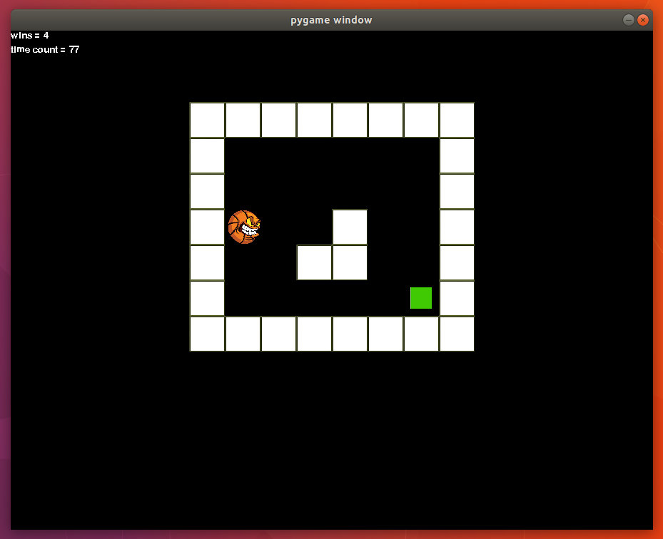

# Pygame QLearning Algorithm

This Q learning agent is build in a pygame environment. The Q learning agent code is kept seperate from the pygame environment code in the Qlearner.py file. This is the brain of the program. This is so the agent can be taken out of the pygame environment and used in other environments.

# Requiremnets:
python.
pygame.
files from in the repository.

To run this code, first install [python](https://www.python.org/downloads/) and [pygame](https://www.pygame.org/). Then clone or download this repository and run the [main.py](main.py) file. 

